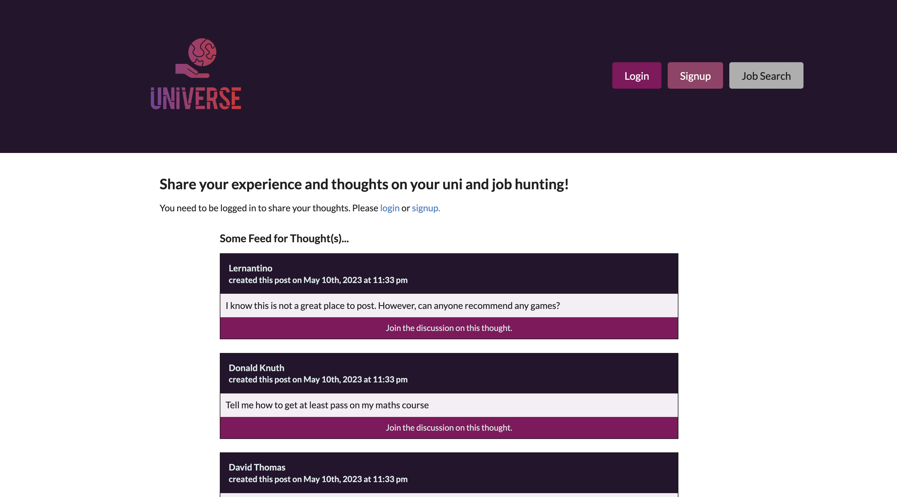

# Final project - UNIverse

## Deployed Application

This application can be found from https://secret-brook-49056.herokuapp.com/

## Introduction

This project was to build a social media app where students can post their opinion based on their experiences and share their thoughts on things such as reptutation of the courses, degrees and even their campus life-style. This app will be built by using MERN stack that is MongoDB, ExpressJS, ReactJS and NodeJS.


## Brief Demo

This is what you are going to see when you load the website!




## User Stories

```md
AS an user (student)
I WANT to see reviews/posts to read
SO THAT I can get some ideas on my future courses
```

## Acceptance Criteria

```md
GIVEN an "Universe" website
WHEN I load the website
THEN I am presented with Home page
WHEN I click on Signup button
THEN I am presented with three inputs for a username, an email address, and a password.
WHEN I enter a valid email address and create a password and click on the signup button
THEN my user account is created and I am logged in to the site
WHEN I click on Login button
THEN I am presented with two inputs for an email address and a password and login button
WHEN I log in
THEN I can see my profile that shows a list of posts that I generated
WHEN I click Go Back button
THEN I am presented with posts on home page.
WHEN I click "Join the discussion on this thought"
THEN I should be able to see the comments

```

## Project requirement

* Use React for the front end.

* Use GraphQL with a Node.js and Express.js server.

* Use MongoDB and the Mongoose ODM for the database.

* Use queries and mutations for retrieving, adding, updating, and deleting data.

* Be deployed using Heroku (with data).

* Have a polished UI.

* Be responsive.

* Be interactive (i.e., accept and respond to user input).

* Include authentication (JWT).

* Protect sensitive API key information on the server.

* Have a clean repository that meets quality coding standards (file structure, naming conventions, best practices for class and id naming conventions, indentation, high-quality comments, etc.).

* Have a high-quality README (with unique name, description, technologies used, screenshot, and link to deployed application).

## Technologies 

* ReactJS

* JavaScript

* MongoDB

* Expressjs

* NodeJs

* Graphql

* JWT

